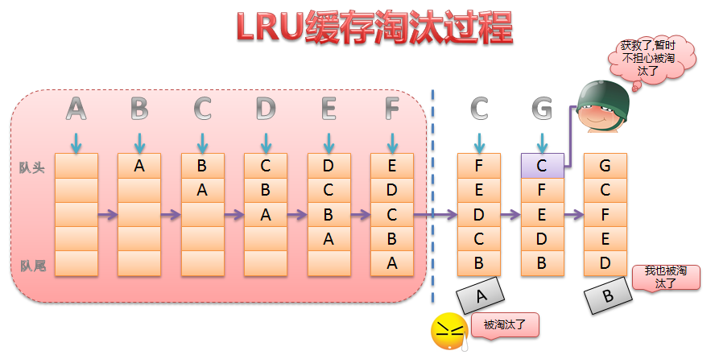

# Redis的缓存淘汰策略LRU与LFU

## maxmemory 配置指令

```
maxmemory 100mb
maxmemory-policy noeviction
```

> - `maxmemory`指令用于指定Redis的最大内存。既可以在redis.conf中配置，也可以通过`config set maxmemory 100mb` 来动态修改。
>
> - 当内存达到最大使用限制时，Redis根据`缓存淘汰策略`来返回错误信息或者删除老数据，为写入新数据腾出空间。
> - maxmemory = 0 时，表示不进行内存限制。但是对于32位系统，隐含的限制条件为：最多 `3G`内存
> - 在Redis服务运行过程中，可以随时通过命令动态设置驱逐策略，然后通过`INFO`命令监控缓存丢失和命中的情况进行调优。
> - 如果Redis中没有expire的key，则volatile-lru、volatile-random、volatile-ttl策略基本等同于noeviction，但是不报错，忽略写操作，读操作正常。

## 缓存淘汰策略选择依据

> - Redis中如果有冷热数据，推荐使用allkeys-lru。也就是说所有key的读写频率有不同，allkeys-lru是比较适合的。
> - 如果不确定具体的业务特征，那么allkeys-lru也是个很好的选择
> - 如果所有keys的读写频率差不多，则可以使用allkeys-random策略
> - 如果有很多设置了过期时间的键，则可以使用volatile-ttl策略
> - <font color=#FF0000>如果Redis中既有缓存，又有持久key，则只能考虑volatile-lru、volatitle-random、noeviction。 一般来说，类似这种场景，应该使用两个单独的Redis实例</font>
> - 对于缓存来说，设置expire会额外消耗内存，所以如果使用allkeys-lru策略，可以更高效的利用内存，也就不需要设置过期时间了。


## 常用缓存淘汰算法

## LRU

```
Least Recently Used   最近最少使用。判断最近被使用的时间，距离最远的最先被淘汰。 对比的是时间。
```



## LFU

```
Least Frequently Used  最不经常使用。在一段时间内，数据被使用次数最少的最先被淘汰。 对比的是次数。
```


## FIFO

```
First In First Out, 先进先出。
```
 

## ARC

```
Adaptive Replacement Cache-ARC，自适应缓存替换算法。在IBM Almaden研究中心开发，这个缓存算法同时跟踪记录LFU和LRU，以及驱逐缓存条目，来获得可用缓存的最佳使用。
```


## MRU

```
Most Recently Used，最近最常使用算法，与LRU正好相反。
对于一个LRU的队列来说，通常是队尾插入，队头淘汰，如果有读写操作，则将该读写操作的元素放置在队尾。 那么这里的队头就是LRU端，队尾就是MRU端，如果淘汰时从队尾淘汰，这就是MRU算法。
```

